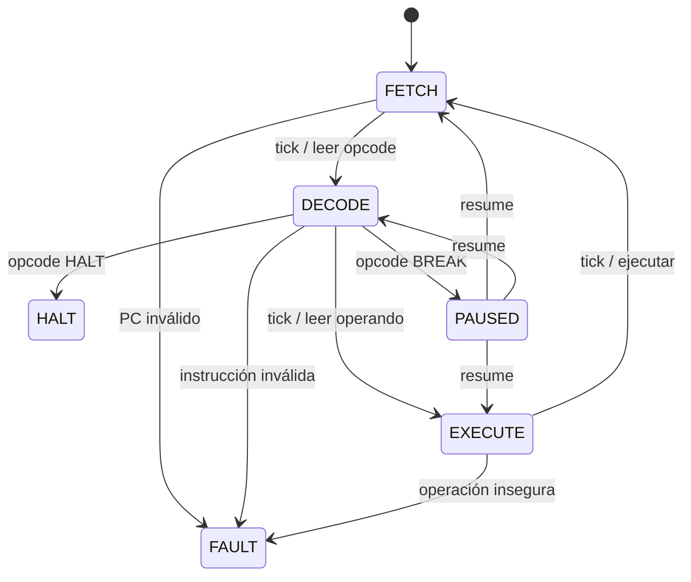

# CPU Digital con Tramoya

Simulador educativo de una CPU acumuladora de **16 bits**, construido sobre
[Tramoya 1.5.3](https://pypi.org/project/tramoya/). Ejecuta programas escritos en
un pequeño lenguaje ensamblador y permite observar cada microestado del procesador.

El repositorio ahora contiene dos arquitecturas:

- **Tramoya VM32:** runtime RISC de 32 bits para scripts seguros, automatización,
  videojuegos, reglas de negocio y extensiones embebidas. Incluye FPU IEEE 754,
  aritmética de 64 bits, fibras cooperativas y el **Chip Neuronal Tramoya (TNU)**,
  un coprocesador vectorial con el que un programa `.tasm` ejecuta llama2.c.
  Es la opción recomendada
  para aplicaciones reales. Consulta [VM32.md](VM32.md) y la especificación técnica
  [RFC EXP 00015](RFC-EXP-00015.md).
- **CPU Digital 16:** arquitectura pequeña para inspección ciclo a ciclo y
  compatibilidad con el ejemplo original.

Inicio rápido con VM32:

```powershell
.\.venv\Scripts\python.exe tramoya_vm.py --demo factorial --trace
.\.venv\Scripts\python.exe tramoya_vm.py --demo hola --compile hola.tvm
```

## Consola web local

VM32 incluye una interfaz de instrumentación sin dependencias web externas. Permite
editar y ensamblar programas, ejecutar por pasos o por bloques, establecer
breakpoints, entregar entradas, solicitar interrupciones y observar registros,
banderas, memoria, pila, recursos, salida, símbolos y traza en tiempo real.

```powershell
.\.venv\Scripts\python.exe -m cpu_digital.ui_server
```

La consola abre `http://127.0.0.1:8765/` y solo escucha en el equipo local. La API
rechaza peticiones con un `Host` u `Origin` ajenos y exige `Content-Type` JSON, de modo
que otras páginas abiertas en el navegador no pueden controlarla. Con `--host` solo se
aceptan los nombres de loopback y ese mismo host: para abrirla desde la red local usa
`--host <IP-de-la-máquina>` y entra por esa IP (`0.0.0.0` solo admite loopback). También
puedes iniciarla con el comando `tramoya-ui` después de instalar el proyecto. Usa
`--no-open` si no quieres que abra el navegador automáticamente.

## Rendimiento y memoria VM32

- 1 048 576 palabras de RAM lógica por defecto (4 MiB).
- Hasta 16 777 216 palabras configurables (64 MiB).
- Páginas físicas de 16 KiB asignadas bajo demanda.
- Caché de instrucciones con invalidación para código automodificable.
- Ejecución continua optimizada (~0,55 M instr/s) con acelerador de bucles
  internos que conserva el estado exacto del intérprete (~5,5 M instr/s en bucles).
- Snapshots v2 dispersos y compatibles con snapshots densos v1.
- Ensamblador limitado antes de reservar `.space` para evitar agotamiento accidental.
- **79 instrucciones** en formato fijo de 4 palabras.
- **FPU softcore** IEEE 754 single-precision (9 instrucciones).
- **Aritmética extendida** de 64 bits con cadena de carry (3 instrucciones).
- **Fibras cooperativas** con context switch completo (3 instrucciones).
- **TNU**: 18 instrucciones vectoriales ejecutadas por el host (capacidad `npu`).

## Chip de memoria no volátil

El componente `NonVolatileMemoryChip` modela un chip persistente e independiente
de la RAM de VM32. Su capacidad predeterminada es de **500 MB decimales**
(500 000 000 bytes, aproximadamente 476,84 MiB). Usa almacenamiento por páginas
en un archivo SQLite: al crearlo solo se guarda la metadata; el archivo crece al
escribir datos y el contenido permanece tras cerrar y volver a abrir el chip.

```python
from cpu_digital import NonVolatileMemoryChip

with NonVolatileMemoryChip("chips/flash_500mb.sqlite") as chip:
    chip.write(0, b"datos persistentes")
    print(chip.read(0, 18))
```

La dirección y la longitud se expresan en bytes. `allocated_bytes` informa el
contenido guardado, no el espacio total del archivo SQLite ni la RAM del proceso.
Las syscalls VM32 9 y 10 leen y escriben el chip en bloques de hasta 4 096 bytes;
la syscall 11 consulta su capacidad. La consola web conecta por defecto
`chips/flash_500mb.sqlite`. Para la CLI, indica el chip al ejecutar el programa:

```powershell
.\.venv\Scripts\python.exe tramoya_vm.py programa.tasm --memory-chip chips\flash_500mb.sqlite
```

Las escrituras de programas son persistentes y quedan fuera de los snapshots de
RAM VM32.

Benchmark reproducible:

```powershell
.\.venv\Scripts\python.exe benchmarks\benchmark_vm32.py
```

## Chip Neuronal Tramoya (TNU)

Coprocesador conectado a VM32 tras la capacidad `npu`. Ejecuta en el host
productos matriz-vector (float32 e int8), softmax, RMSNorm, RoPE, SiLU y muestreo
sobre la memoria del invitado, y mapea una ROM de pesos de solo lectura que no
entra en los snapshots (solo su sha256). El invitado orquesta el transformer: el
demo `vm_programs/llama2.tasm` ejecuta modelos de llama2.c y escribe texto.

```powershell
# Modelos de https://huggingface.co/karpathy/tinyllamas (descarga manual a models/)
.\.venv\Scripts\python.exe -m cpu_digital.tnu_models models\stories260K.bin models\tok512.bin models\stories260K.trom
.\.venv\Scripts\python.exe tramoya_vm.py --demo llama2 --npu-rom models\stories260K.trom --gas 2000000000 --trace-buffer 0 --input 128 0 1 0
.\.venv\Scripts\python.exe benchmarks\benchmark_tnu.py
```

Medido en Python 3.13.2 / Windows x64 (`benchmarks/benchmark_tnu.py`): stories260K
a ~42 tok/s, stories15M a ~3,0 tok/s en float32 y ~3,5 tok/s en int8, con salida
idéntica entre ejecuciones con la misma semilla. Requiere Python ≥ 3.12. Detalles en
[VM32.md](VM32.md) y en la propuesta P5 de [RFC-EXP-00016](RFC-EXP-00016.md).

## Qué puede hacer

- Ciclo real de control `FETCH → DECODE → EXECUTE`.
- Memoria unificada configurable (256 palabras por defecto).
- Aritmética con signo y overflow de 16 bits.
- Comparaciones, saltos y ciclos.
- Pila, subrutinas con `CALL/RET` y límite de profundidad.
- Entrada numérica y salida numérica o de caracteres.
- Pausas externas, instrucción `BREAK` y breakpoints por etiqueta.
- Fallos controlados: opcode o dirección inválida, división entre cero,
  pila vacía/llena, entrada agotada y límite de ciclos.
- Ensamblador de dos pasadas con etiquetas, referencias futuras, aliases,
  `.EQU`, `.ORG`, `.WORD` y `.STRING`.
- Traza completa de registros y microestados.
- Undo de estado **y contexto**, snapshots JSON y restauración.
- Diagramas Mermaid y Graphviz generados por Tramoya.
- Depurador interactivo desde la terminal.

## Arquitectura



Una instrucción ordinaria consume tres ciclos: uno por cada etapa. `HALT` y
`BREAK` consumen `FETCH + DECODE`.

## Instalación

Requiere Python 3.10 o posterior.

```powershell
python -m venv .venv
.\.venv\Scripts\python.exe -m pip install -e .
```

También se puede instalar únicamente la dependencia:

```powershell
python -m pip install -r requirements.txt
```

## Uso rápido

```powershell
# 15 + 25
.\.venv\Scripts\python.exe cpu_simulator.py

# Suma de 1 a 10 con un ciclo
.\.venv\Scripts\python.exe cpu_simulator.py --demo ciclo --trace

# Factorial de 5 y listado ensamblado
.\.venv\Scripts\python.exe cpu_simulator.py --demo factorial --listing

# Suma dos entradas
.\.venv\Scripts\python.exe cpu_simulator.py --demo entrada --input 7 8

# Ejecuta un archivo propio
.\.venv\Scripts\python.exe cpu_simulator.py mi_programa.asm
```

Ejemplos disponibles: `suma`, `ciclo`, `factorial`, `subrutina`, `entrada`,
`hola` y `breakpoint`.

## Depuración

```powershell
.\.venv\Scripts\python.exe cpu_simulator.py --demo ciclo --debug --breakpoint BUCLE
```

Comandos del depurador:

- `step`: ejecuta un microestado.
- `run`: continúa hasta `HALT`, `FAULT`, `BREAK` o un breakpoint.
- `resume`: sale de `PAUSED` y vuelve al microestado exacto.
- `regs`: muestra registros y banderas.
- `mem INICIO CANTIDAD`: inspecciona memoria.
- `trace CANTIDAD`: muestra las últimas transiciones.
- `undo`: revierte una transición y todo su contexto con Tramoya.
- `save ARCHIVO` / `load ARCHIVO`: persiste o restaura un snapshot.
- `diagram`: imprime el diagrama Mermaid.

## Ensamblador

```asm
; Suma 1..10
        LOADI 0
        SAVE TOTAL
        LOADI 10
        SAVE CONTADOR

BUCLE:  LOAD TOTAL
        ADD CONTADOR
        SAVE TOTAL
        LOAD CONTADOR
        SUBI 1
        SAVE CONTADOR
        JNZ BUCLE

        LOAD TOTAL
        OUT
        HALT

TOTAL:    .WORD 0
CONTADOR: .WORD 0
```

Los números aceptan decimal, hexadecimal (`0x2A`), binario (`0b101010`) y
caracteres (`'A'`). Las etiquetas no distinguen mayúsculas de minúsculas.

## Conjunto de instrucciones

| Grupo | Instrucciones |
|---|---|
| Control | `NOP`, `BREAK`, `HALT` |
| Datos | `LOAD`, `LOADI`, `SAVE` |
| Aritmética | `ADD`, `ADDI`, `SUB`, `SUBI`, `MUL`, `MULI`, `DIV`, `MOD` |
| Comparación | `CMP`, `CMPI` |
| Saltos | `JMP`, `JZ`, `JNZ`, `JNEG`, `JPOS`, `JLT`, `JGT` |
| Entrada/salida | `IN`, `OUT`, `OUTC` |
| Pila | `PUSH`, `POP`, `CALL`, `RET` |
| Bits | `AND`, `OR`, `XOR`, `NOT`, `SHL`, `SHR` |

Las instrucciones con sufijo `I` reciben un valor inmediato. `LOAD`, `ADD`,
`SUB`, `MUL`, `DIV`, `MOD`, `SAVE`, `CMP`, `AND`, `OR` y `XOR` reciben una
dirección de memoria. Los saltos y `CALL` reciben una dirección de código.

## Cómo se explota Tramoya

El procesador no simula sus estados con una cadena de `if` externa. Su unidad de
control es una `Machine` real creada con `MachineBuilder`:

- Guardias competidoras deciden la ruta correcta para cada `tick`.
- Las guardias reciben el contexto de solo lectura.
- Una excepción en acciones o hooks revierte estado, memoria y registros.
- Los hooks `on_enter` mantienen consistentes `HALT`, `FAULT` y `PAUSED`.
- Transiciones wildcard permiten `pause` y `timeout` desde cualquier microestado.
- Un observador construye la traza sin contaminar la lógica de la CPU.
- El callback global registra la última transición.
- El historial profundo permite `undo()` sobre estado y contexto.
- `to_json()`/`load_dict()` proporcionan persistencia transaccional.
- `to_mermaid()` y `to_dot()` documentan la topología ejecutable, no un dibujo manual.

## Snapshots y diagramas

```powershell
# Guardar ejecución final
.\.venv\Scripts\python.exe cpu_simulator.py --demo factorial --save snapshots\factorial.json

# Restaurarla
.\.venv\Scripts\python.exe cpu_simulator.py --load snapshots\factorial.json

# Imprimir topología
.\.venv\Scripts\python.exe cpu_simulator.py --diagram mermaid
.\.venv\Scripts\python.exe cpu_simulator.py --diagram dot
```

## Pruebas

```powershell
.\.venv\Scripts\python.exe -m unittest discover -s tests -v
```

Las pruebas cubren compatibilidad con el programa original, ensamblado,
aritmética, ciclos, subrutinas, E/S, overflow, fallos, timeout, pausa/reanudación,
undo, snapshots y diagramas.

## Estructura

```text
cpu_simulator.py          CLI y depurador (CPU 16)
tramoya_vm.py             CLI y depurador (VM32)
cpu_digital/
  cpu.py                  CPU de 16 bits y unidad de control Tramoya
  isa.py                  ISA de 16 bits
  assembler.py            ensamblador/desensamblador (16 bits)
  vm32.py                 VM de 32 bits con FPU, aritmética 64-bit y fibras
  vm32_loops.py           acelerador de bucles (compila bucles calientes con semántica exacta)
  vm32_isa.py             ISA de 32 bits (79 instrucciones)
  tnu.py                  Chip Neuronal Tramoya: ROM de tensores y núcleos vectoriales
  tnu_models.py           ROM de llama2.c, BPE y referencia de host
  vm32_assembler.py       ensamblador/desensamblador (VM32)
  memory.py               memoria paginada de palabras int32
  ui_server.py            consola web de instrumentación
programs/                 ejemplos .asm (CPU 16)
vm_programs/              ejemplos .tasm (VM32)
tests/                    pruebas automáticas
benchmarks/               benchmarks de rendimiento
```

Es un simulador educativo: modela flujo de control, registros y memoria, no
tiempos eléctricos, cachés, pipelines ni concurrencia de un procesador físico.
