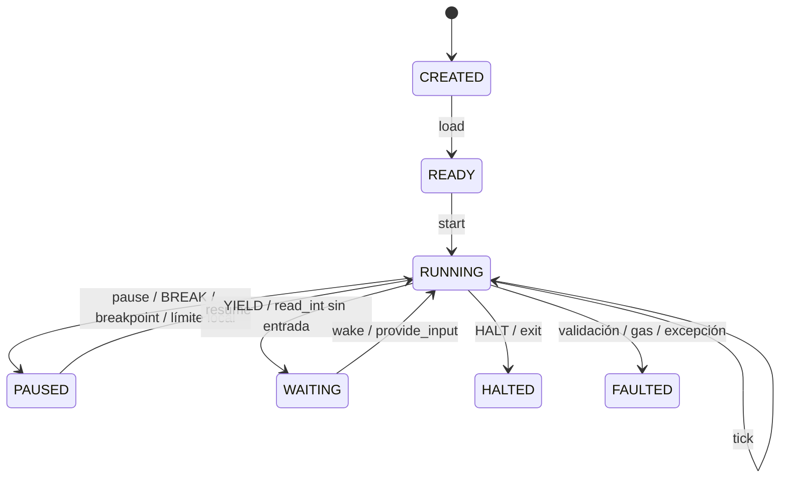
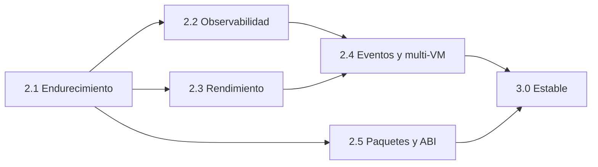

# RFC EXP 00015 — Tramoya VM32

| Campo | Valor |
|---|---|
| Identificador | RFC EXP 00015 |
| Título | Tramoya VM32: máquina virtual RISC determinista, observable y limitada por recursos |
| Estado | Experimental |
| Implementación de referencia | CPU Digital Tramoya 2.0.0 |
| Motor de control | Tramoya 1.5.3 |
| Fecha de actualización | 2026-08-17 |
| Idioma normativo | Español |

## 1. Resumen

Tramoya VM32 es una máquina virtual RISC de 32 bits diseñada para ejecutar lógica
extensible con un comportamiento pequeño, observable y limitado por recursos. No
intenta reproducir transistores, cachés ni temporización eléctrica. Su objetivo es
ofrecer una frontera de ejecución más controlable que ejecutar Python arbitrario.

La VM combina:

- una ISA de 44 instrucciones y ancho fijo;
- enteros de 32 bits con semántica explícita;
- memoria lineal y pila limitada;
- gas, límites de salida y validación de direcciones;
- syscalls autorizadas por capacidades;
- pausa, espera cooperativa, interrupciones y reanudación;
- rollback atómico por instrucción;
- bytecode versionado y snapshots transaccionales;
- una máquina de estados Tramoya para controlar el ciclo de vida;
- instrumentación mediante registros, banderas, traza, memoria y diagramas.

El resultado busca ser útil como runtime embebido para reglas, automatización,
scripts de juegos, plugins limitados, flujos reanudables y evaluación de código.

## 2. Estado de este documento

Este documento define el comportamiento de la implementación experimental actual.
No es un estándar de Internet ni una garantía de estabilidad binaria futura.

Las palabras **DEBE**, **NO DEBE**, **DEBERÍA**, **NO DEBERÍA** y **PUEDE** indican
requisitos normativos dentro de este experimento:

- **DEBE / NO DEBE:** requisito para considerarse compatible con RFC EXP 00015.
- **DEBERÍA / NO DEBERÍA:** recomendación que puede omitirse con una razón clara.
- **PUEDE:** comportamiento opcional.

Una versión futura que cambie el formato de palabra, banderas, bytecode o ciclo de
vida deberá usar otra versión de formato o un RFC sucesor.

## 3. Problema que se intenta resolver

Muchos productos necesitan ejecutar lógica que cambia con mayor frecuencia que el
host: reglas de precios, comportamiento de entidades, validadores, automatizaciones,
retos de programación o extensiones. Ejecutar esa lógica directamente como Python
ofrece demasiado poder: imports, disco, red, procesos y memoria del host.

VM32 intenta separar cuatro conceptos:

1. **Programa:** bytecode y datos que no tienen autoridad por sí mismos.
2. **Máquina:** estado determinista que interpreta el programa.
3. **Capacidades:** operaciones que el host decide exponer.
4. **Presupuesto:** gas, memoria, pila, traza y salida permitidos.

El objetivo no es declarar que el código deja de ser riesgoso. El objetivo es
reducir y hacer visible su autoridad, medir su trabajo y detenerlo de forma
controlada.

## 4. Objetivos

La implementación DEBE priorizar:

- determinismo cuando programa, entradas y eventos del host son iguales;
- validación incluso si el bytecode no fue producido por el ensamblador oficial;
- límites explícitos antes de consumir recursos sin control;
- fallos representados como estado, no como corrupción silenciosa;
- observabilidad suficiente para explicar una ejecución;
- portabilidad del programa entre instancias compatibles;
- integración pequeña con aplicaciones Python;
- ausencia de acceso implícito al sistema operativo.

## 5. No objetivos

VM32 no pretende ser:

- una CPU física, FPGA o simulador de señales;
- un sistema operativo;
- una arquitectura compatible con x86, ARM o RISC-V;
- una sandbox aislada a nivel de proceso;
- un runtime de alto rendimiento con JIT;
- una plataforma de cómputo en coma flotante;
- un sustituto automático de contenedores para código hostil;
- una blockchain o sistema de consenso;
- un entorno con recolección de basura o multitarea preventiva.

## 6. Modelo abstracto de la máquina

El estado observable de una instancia puede representarse como:

```text
S = (q, PC, R, F, M, P, I, O, V, Qirq, Dint, G, C, N, H)
```

donde:

- `q` es el estado de ciclo de vida;
- `PC` es el contador de programa medido en palabras;
- `R` es el vector de 16 registros;
- `F = (Z, N, C, O)` son las banderas;
- `M` es la memoria lineal;
- `P` es la pila;
- `I` y `O` son las colas de entrada y salida;
- `V` es la tabla de vectores de interrupción;
- `Qirq` es la cola de interrupciones pendientes;
- `Dint` es la pila de contextos de interrupción;
- `G` es el gas restante;
- `C` son los ciclos acumulados;
- `N` son las instrucciones completadas;
- `H` es el puntero del heap lineal.

Una instrucción define una transición parcial:

```text
T_i : S → S'  o  S → FAULTED
```

La transición es parcial porque algunas combinaciones —por ejemplo, división entre
cero o lectura fuera de memoria— no producen un valor normal. En esos casos, la
instrucción se revierte y la máquina pasa a `FAULTED`.

## 7. Palabras y representación numérica

### 7.1 Palabra

La unidad de datos es una palabra de 32 bits. La memoria está direccionada por
palabras, no por bytes. Por ello, una memoria de 65 536 palabras representa 256 KiB
de datos lógicos.

Para cualquier entero matemático `x`, se define:

```text
u32(x) = x mod 2^32

s32(x) = u32(x),                    si u32(x) < 2^31
         u32(x) - 2^32,             en otro caso
```

`u32` interpreta el patrón como entero sin signo de `0` a `4 294 967 295`.
`s32` interpreta el mismo patrón en complemento a dos de `-2 147 483 648` a
`2 147 483 647`.

Toda escritura ordinaria en registros, memoria o pila DEBE normalizarse con `s32`.

### 7.2 Registros

La máquina contiene 16 registros:

| Registro | Semántica |
|---|---|
| `R0` | Cero constante. Las escrituras se ignoran. |
| `R1` | Registro general y argumento/retorno principal de syscalls. |
| `R2..R14` | Registros generales. |
| `R15` | Profundidad actual de la pila; solo lectura. |

`R15` no contiene una dirección física. Su valor es `len(P)` y se sincroniza después
de cada operación de pila.

### 7.3 Banderas

| Bandera | Nombre | Condición |
|---|---|---|
| `Z` | Zero | El resultado normalizado es cero. |
| `N` | Negative | El resultado `s32` es negativo. |
| `C` | Carry | Acarreo en suma o ausencia de préstamo en resta. |
| `O` | Overflow | El resultado matemático no cabe en el dominio con signo esperado. |

Las operaciones que escriben un resultado actualizan `Z` y `N`. Cuando una operación
no define acarreo u overflow, la implementación actual restablece `C=0` y `O=0`.

## 8. Memoria y mapa del programa

La memoria es un vector:

```text
M : {0, …, memory_words - 1} → int32
```

La configuración predeterminada usa 1 048 576 palabras (4 MiB lógicos). Se permiten
entre 256 y 16 777 216 palabras (64 MiB lógicos). La implementación de referencia
divide el espacio en páginas de 4 096 palabras y solo materializa páginas escritas.

El programa se coloca así:

```text
0                                      code_size
┌──────────────── segmento .code ────────────────┐
│ instrucciones, cuatro palabras cada una        │
└────────────────────────────────────────────────┘
                                                  code_size + data_size
                                                  ┌──── segmento .data ────┐
                                                  │ datos y cadenas         │
                                                  └─────────────────────────┘
```

En términos exactos:

```text
dirección_dato = code_size + desplazamiento_en_data
heap_inicial   = code_size + data_size
```

Si `protect_code=True`, una escritura a una dirección menor que `code_size` DEBE
fallar. El heap incluido es un asignador lineal o *bump allocator*: `alloc(n)`
devuelve `H` y después ejecuta `H ← H+n`. No existe `free`.

### 8.1 Dirección efectiva

Las operaciones `LOAD` y `STORE` usan:

```text
EA = R[base] + offset
```

El acceso solo continúa si `0 ≤ EA < memory_words`. Como `R0=0`, una dirección
`[ETIQUETA]` se codifica como base `R0` más una dirección absoluta.

## 9. Formato de instrucción

Cada instrucción ocupa exactamente cuatro palabras:

```text
┌──────────┬──────────┬──────────┬──────────┐
│ opcode   │ a        │ b        │ c        │
│ int32    │ int32    │ int32    │ int32    │
└──────────┴──────────┴──────────┴──────────┘
```

El ancho fijo implica:

```text
PC_siguiente = PC_actual + 4
PC_válido    ⇔ 0 ≤ PC < code_size ∧ PC mod 4 = 0
```

Las ventajas son decodificación constante, validación sencilla y saltos directos.
El costo es un bytecode menos denso: incluso `NOP` ocupa 16 bytes serializados.

## 10. Ciclo de vida controlado por Tramoya



El ciclo de vida no es una cadena decorativa. Una `Machine` de Tramoya valida los
triggers, ejecuta guardias y hooks, conserva historial de transiciones y mantiene el
contexto de control.

| Estado | Significado |
|---|---|
| `CREATED` | VM construida, sin programa cargado. |
| `READY` | Programa cargado y listo para iniciar. |
| `RUNNING` | Puede procesar `tick`. |
| `PAUSED` | Ejecución detenida, reanudable desde el mismo `PC`. |
| `WAITING` | Espera una acción del host. |
| `HALTED` | Terminación final con código de salida. |
| `FAULTED` | Fallo final controlado. |

`HALTED` y `FAULTED` son estados finales para esa carga. `reload()` crea una nueva
ejecución del mismo programa.

## 11. Algoritmo de ejecución

### 11.1 Paso atómico

El algoritmo conceptual de una instrucción es:

```text
step(S):
    si q = READY:
        q ← RUNNING
    si q ≠ RUNNING:
        devolver S

    crear checkpoint de estado mutable no-RAM
    iniciar journal vacío de escrituras RAM

    intentar:
        si interrupciones habilitadas y Qirq no está vacía:
            despachar una interrupción externa
        de otro modo:
            validar PC ejecutable
            (opcode, a, b, c) ← M[PC : PC+4]
            validar opcode
            validar G ≥ coste(opcode)
            PC ← PC + 4
            ejecutar opcode(a, b, c)
            N ← N + 1
            C ← C + coste(opcode)
            G ← G - coste(opcode)

    capturar HALT, WAIT o PAUSE como evento de ciclo de vida
    ante cualquier fallo:
        restaurar checkpoint
        revertir direcciones registradas en el journal RAM
        preparar transición FAULTED

    sincronizar R0 y R15
    registrar traza y última instrucción
    aplicar evento de ciclo de vida
```

El `PC` avanza antes del despacho. Así, `CALL` puede apilar directamente la dirección
de retorno. Si la instrucción falla, el checkpoint restaura el `PC` anterior.

### 11.2 Ejecución continua

`run(max_instructions, breakpoints)` repite el núcleo atómico mientras `q=RUNNING`.
Evita crear una transición `tick` de Tramoya por cada opcode, pero conserva las
transiciones que cambian el ciclo de vida y la traza VM32. `step()` mantiene la ruta
completamente instrumentada para depuración interactiva.

Antes de cada instrucción evalúa:

1. si `PC` pertenece al conjunto de breakpoints;
2. si se alcanzó el límite local de instrucciones;
3. en caso contrario, ejecuta un paso.

Un límite local no consume el gas restante ni produce un fallo. Produce `PAUSED`, lo
que permite a una UI ejecutar en bloques pequeños y conservar capacidad de respuesta.

### 11.3 Gas y ciclos

Para una secuencia de instrucciones `i₀, …, iₙ₋₁` y `E` entradas de interrupción
externa despachadas:

```text
G_n = G_0 - Σ coste(i_k) - E
C_n = C_0 + Σ coste(i_k) + E
```

Una instrucción solo puede comenzar si:

```text
G_actual ≥ coste(instrucción)
```

El gas se verifica antes del efecto de la instrucción. Por tanto, una operación no
queda parcialmente ejecutada por falta de gas.

Gas no equivale a tiempo real. Es una medida determinista de trabajo lógico. Una
syscall del host puede tardar un tiempo arbitrario aunque su instrucción tenga coste 5.
Una entrada de interrupción externa consume una unidad de gas y un ciclo, pero no
incrementa el contador de instrucciones del programa.

## 12. Matemática de la ALU

### 12.1 Suma

Para `ADD Rd, Ra, Rb`:

```text
raw = s32(Ra) + s32(Rb)
r   = s32(raw)
Rd  = r

Z = (r = 0)
N = (r < 0)
C = (u32(Ra) + u32(Rb) > 2^32 - 1)
O = (signo(Ra) = signo(Rb)) ∧ (signo(r) ≠ signo(Ra))
```

Ejemplo:

```text
0x7FFFFFFF + 1 = 0x80000000
r = -2147483648, Z=0, N=1, C=0, O=1
```

### 12.2 Resta y comparación

Para `SUB Rd, Ra, Rb`:

```text
r  = s32(Ra - Rb)
Rd = r

Z = (r = 0)
N = (r < 0)
C = (u32(Ra) ≥ u32(Rb))        ; C=1 significa “sin préstamo”
O = (signo(Ra) ≠ signo(Rb)) ∧ (signo(r) ≠ signo(Ra))
```

`CMP` y `CMPI` calculan las mismas banderas, pero no guardan `r`.

### 12.3 Multiplicación

```text
raw = Ra × Rb
r   = s32(raw)
O   = (r ≠ raw)
```

La multiplicación es modular en `2^32`; `O` informa que el resultado matemático con
signo no se conservó exactamente.

### 12.4 División y módulo

La división entre cero DEBE fallar. Para divisor no nulo, el cociente trunca hacia
cero:

```text
q = floor(|a| / |b|)
si signo(a) ≠ signo(b): q = -q
r = a - q × b
```

Se mantiene la identidad:

```text
a = q × b + r
```

Ejemplo: `-7 / 3 = -2` y `-7 mod 3 = -1`.

### 12.5 Operaciones de bits

`AND`, `OR`, `XOR` y `NOT` operan sobre el patrón de 32 bits y normalizan el
resultado a `s32`.

Los desplazamientos solo aceptan `0 ≤ n ≤ 31`:

- `SHL` desplaza a la izquierda, conserva 32 bits y coloca en `C` el último bit
  expulsado por la izquierda.
- `SHR` es aritmético sobre el entero con signo y coloca en `C` el último bit
  expulsado por la derecha.
- para `n=0`, `C=0`.

`TEST Ra, Rb` actualiza `Z` y `N` con `Ra AND Rb` sin escribir un registro.

## 13. Flujo de control, pila y llamadas

Los saltos solo aceptan destinos ejecutables y alineados.

| Instrucción | Condición |
|---|---|
| `JMP` | Siempre |
| `JZ` | `Z=1` |
| `JNZ` | `Z=0` |
| `JNEG` | `N=1` |
| `JPOS` | `Z=0 ∧ N=0` |
| `JC` | `C=1` |
| `JNC` | `C=0` |

La pila almacena palabras normalizadas. Si `depth = len(P)`:

```text
PUSH x: requiere depth < stack_limit; P.append(s32(x))
POP:    requiere depth > 0; devuelve P.pop()
```

`CALL target` ejecuta:

```text
PUSH PC_siguiente
PC ← target
```

`RET` ejecuta `PC ← POP()`. `CALLR` toma el destino desde un registro.

## 14. Interrupciones

Existen 256 vectores, numerados de 0 a 255. Una tabla relaciona cada vector con una
dirección ejecutable.

El contexto de una interrupción es:

```text
contexto_irq = (PC_retorno, banderas, interrupciones_habilitadas)
```

Al entrar:

```text
requiere vector configurado
requiere depth_irq < interrupt_depth
apilar contexto_irq
PC ← dirección_del_vector
interrupciones_habilitadas ← false
```

`IRET` restaura el contexto completo. Una interrupción externa se encola y se atiende
antes de la siguiente instrucción cuando las interrupciones están habilitadas. `INT`
es una interrupción de software síncrona y entra directamente. `EI` y `DI` habilitan
o enmascaran la entrega externa.

`SETIV` desde bytecode requiere la capacidad `interrupt_control`. Esa capacidad no
forma parte del conjunto predeterminado. El host confiable puede configurar vectores
mediante su API sin delegar ese permiso al programa.

## 15. Espera cooperativa

`YIELD` mueve la máquina a `WAITING`. La syscall `read_int` también espera si la cola
de entrada está vacía; en ese caso retrocede el `PC` cuatro palabras para repetir la
misma syscall después del despertar.

El host puede:

```text
provide_input(valores) → añade valores y ejecuta wake si q=WAITING
wake()                 → reanuda una espera que no depende de entrada
```

Este modelo permite flujos reanudables sin mantener un hilo bloqueado.

## 16. Conjunto de instrucciones

Todos los costes omitidos son 1.

| Grupo | Instrucción | Forma | Coste | Efecto resumido |
|---|---|---:|---:|---|
| Control | `NOP` | — | 1 | Sin efecto. |
| Datos | `MOV Rd, Rs` | reg, reg | 1 | Copia registro. |
| Datos | `MOVI Rd, imm` | reg, inm | 1 | Carga inmediato. |
| Datos | `LEA Rd, target` | reg, dir | 1 | Carga dirección. |
| Datos | `LOAD Rd, [Rb+off]` | reg, mem | 2 | Lee memoria. |
| Datos | `STORE Rs, [Rb+off]` | reg, mem | 2 | Escribe memoria validada. |
| ALU | `ADD Rd, Ra, Rb` | 3 reg | 1 | Suma y banderas. |
| ALU | `ADDI Rd, Ra, imm` | 2 reg, inm | 1 | Suma inmediata. |
| ALU | `SUB Rd, Ra, Rb` | 3 reg | 1 | Resta y banderas. |
| ALU | `SUBI Rd, Ra, imm` | 2 reg, inm | 1 | Resta inmediata. |
| ALU | `MUL Rd, Ra, Rb` | 3 reg | 2 | Producto modular. |
| ALU | `MULI Rd, Ra, imm` | 2 reg, inm | 2 | Producto inmediato. |
| ALU | `DIV Rd, Ra, Rb` | 3 reg | 4 | Cociente hacia cero. |
| ALU | `MOD Rd, Ra, Rb` | 3 reg | 4 | Resto compatible con `DIV`. |
| Comparación | `CMP Ra, Rb` | 2 reg | 1 | Resta virtual; solo banderas. |
| Comparación | `CMPI Ra, imm` | reg, inm | 1 | Comparación inmediata. |
| Comparación | `TEST Ra, Rb` | 2 reg | 1 | AND virtual; solo banderas. |
| Bits | `AND Rd, Ra, Rb` | 3 reg | 1 | AND bit a bit. |
| Bits | `OR Rd, Ra, Rb` | 3 reg | 1 | OR bit a bit. |
| Bits | `XOR Rd, Ra, Rb` | 3 reg | 1 | XOR bit a bit. |
| Bits | `NOT Rd, Rs` | 2 reg | 1 | Complemento. |
| Bits | `SHL Rd, Rs, n` | 2 reg, inm | 1 | Desplazamiento izquierdo. |
| Bits | `SHR Rd, Rs, n` | 2 reg, inm | 1 | Desplazamiento aritmético derecho. |
| Salto | `JMP target` | dir | 1 | Salto incondicional. |
| Salto | `JZ target` | dir | 1 | Salta si cero. |
| Salto | `JNZ target` | dir | 1 | Salta si no cero. |
| Salto | `JNEG target` | dir | 1 | Salta si negativo. |
| Salto | `JPOS target` | dir | 1 | Salta si positivo. |
| Salto | `JC target` | dir | 1 | Salta si carry. |
| Salto | `JNC target` | dir | 1 | Salta si no carry. |
| Pila | `PUSH Rs` | reg | 2 | Apila valor. |
| Pila | `POP Rd` | reg | 2 | Desapila valor. |
| Llamada | `CALL target` | dir | 3 | Apila retorno y salta. |
| Llamada | `CALLR Rs` | reg | 3 | Llamada indirecta. |
| Llamada | `RET` | — | 3 | Retorna desde la pila. |
| Host | `SYSCALL n` | inm | 5 | Invoca servicio autorizado. |
| IRQ | `INT n` | inm | 3 | Interrupción síncrona. |
| IRQ | `IRET` | — | 3 | Restaura contexto IRQ. |
| IRQ | `EI` | — | 1 | Habilita interrupciones externas. |
| IRQ | `DI` | — | 1 | Enmascara interrupciones externas. |
| IRQ | `SETIV n, target` | inm, dir | 2 | Configura vector con capacidad. |
| Cooperación | `YIELD` | — | 1 | Entra en `WAITING`. |
| Depuración | `BREAK` | — | 1 | Entra en `PAUSED`. |
| Terminación | `HALT` | — | 1 | Finaliza con código 0. |

Aliases de ensamblador: `JE=JZ`, `JNE=JNZ`, `JLT=JNEG`, `JGT=JPOS`, `BRK=BREAK`
y `SYS=SYSCALL`.

## 17. Ensamblador

El ensamblador procesa dos secciones, `.code` y `.data`, mediante dos fases lógicas.

### 17.1 Fase 1: análisis y símbolos

Para cada línea:

1. elimina comentarios sin romper cadenas entre comillas;
2. registra etiquetas con su sección y desplazamiento;
3. valida directivas e instrucciones;
4. incrementa el offset de código en 4 por instrucción;
5. calcula el tamaño de cada directiva de datos;
6. conserva registros intermedios para la codificación.

Al finalizar:

```text
símbolo_en_code = offset_code
símbolo_en_data = code_size + offset_data
```

### 17.2 Fase 2: resolución y codificación

La segunda fase resuelve literales, constantes, símbolos y expresiones simples
`SIMBOLO ± desplazamiento`. Después codifica cada instrucción en cuatro palabras y
genera un listado que relaciona línea fuente, dirección y palabras resultantes.

Los destinos de salto DEBEN estar dentro de `.code` y alineados a cuatro palabras.
`LEA` PUEDE cargar direcciones de código o datos.

### 17.3 Directivas

| Directiva | Efecto |
|---|---|
| `.code` / `.text` | Selecciona código. |
| `.data` | Selecciona datos. |
| `.entry etiqueta` | Define el punto de entrada. |
| `.equ nombre valor` | Define una constante literal. |
| `.word a, b, …` | Emite palabras. |
| `.string "texto"` | Emite Unicode por punto de código y terminador cero. |
| `.space n` | Reserva `n` palabras en cero. |
| `.align n` | Alinea datos a una potencia de dos. |

### 17.4 Complejidad

Si `L` es el número de líneas y `W` el número de palabras emitidas:

```text
tiempo de ensamblado = O(L + W)
memoria auxiliar     = O(L + W + símbolos)
```

## 18. Bytecode `.tvm`

El formato binario usa orden little-endian:

```text
cabecera:
    magic          = "TVM2"
    format_version = 1
    header_size
    entry
    code_size
    data_size
    word_count
    crc32(payload)

después:
    metadata_size
    metadata JSON UTF-8
    payload de word_count × int32
```

Los metadatos actuales contienen símbolos y nombre de origen. El CRC32 detecta
corrupción accidental del payload. NO autentica al autor y NO impide modificaciones
maliciosas. Un despliegue que necesite procedencia DEBERÍA firmar el artefacto
completo con un mecanismo criptográfico externo.

## 19. Syscalls y capacidades

Una syscall conecta bytecode sin autoridad con código Python confiable del host.

| Nº | Nombre | Convención | Capacidad |
|---:|---|---|---|
| 0 | `exit` | código en `R1` | ninguna |
| 1 | `print_int` | emite `R1` | `io` |
| 2 | `print_char` | emite el byte bajo de `R1` | `io` |
| 3 | `read_int` | devuelve en `R1` o espera | `io` |
| 4 | `memory_size` | devuelve palabras en `R1` | `introspection` |
| 5 | `cycles` | devuelve ciclos en `R1` | `introspection` |
| 6 | `random` | devuelve PRNG en `R1` | `random` |
| 7 | `print_string` | dirección `R1`, máximo `R2` | `io` |
| 8 | `alloc` | tamaño y resultado en `R1` | `memory` |

Capacidades predeterminadas:

```text
{io, introspection, random, memory}
```

Una syscall con capacidad ausente DEBE fallar antes de ejecutar su handler.

### 19.1 PRNG determinista

La syscall `random` usa xorshift32 con semilla inicial `0x6D2B79F5`:

```text
x ← x XOR ((x << 13) AND 0xFFFFFFFF)
x ← x XOR (x >> 17)
x ← x XOR ((x << 5) AND 0xFFFFFFFF)
x ← x AND 0xFFFFFFFF
```

No es criptográficamente seguro. Su propósito es reproducibilidad en simulaciones.

### 19.2 Contrato para syscalls personalizadas

Un handler PUEDE usar las APIs validadas para:

- leer y escribir registros;
- leer o escribir memoria permitida;
- emitir salida;
- suspender la máquina;
- terminar con un código explícito.

El host NO DEBERÍA entregar referencias internas mutables al programa. También
DEBERÍA validar tamaños, tipos y permisos de cada argumento.

## 20. Atomicidad y rollback

Antes de cada instrucción se crea un checkpoint de:

- `PC`, registros y banderas;
- pila, entrada y salida;
- cola y tabla de interrupciones;
- contextos de interrupción;
- heap, PRNG, contadores y gas.

La RAM no se copia completa. La primera escritura a cada dirección dentro de la
instrucción guarda el valor anterior en un journal:

```text
si address no está en journal:
    journal[address] ← M[address]
M[address] ← nuevo_valor
```

Ante un fallo:

```text
para (address, old_value) en journal:
    M[address] ← old_value
restaurar checkpoint
```

Esto hace atómicas las escrituras de una instrucción, incluidas las realizadas por
una syscall personalizada. No constituye una transacción entre varias instrucciones.

### 20.1 Costo real del checkpoint

El journal evita copiar toda la memoria `M` y la salida se revierte truncándola a su
longitud anterior. La implementación de referencia todavía copia colecciones como
pila, entrada y contextos de interrupción en cada paso. Si sus tamaños son `S`, `I`
y `D`, el costo de checkpoint no es estrictamente constante:

```text
tiempo_step = O(S + I + Qirq + V + D + escrituras_RAM)
```

El despacho puro de una instrucción ordinaria es O(1). Una evolución orientada a
alto rendimiento debería usar estructuras persistentes, journals adicionales o
checkpoints por páginas.

## 21. Snapshots `.tvms`

Un snapshot contiene configuración relevante, programa, ciclo de vida y estado
completo de ejecución. El formato v2 actual es:

```text
magic = "TVMS32\x01"
payload = zlib(JSON UTF-8)
```

La RAM se representa como páginas no vacías con índice y valores. El restaurador
mantiene compatibilidad con el formato v1 que almacenaba un vector denso completo.

La restauración es transaccional:

1. conserva un snapshot del estado anterior;
2. valida firma, versión, tamaño y estructura;
3. intenta aplicar el nuevo estado;
4. verifica registros, memoria, `PC`, pila y límites;
5. si falla, restaura el estado anterior.

El tamaño de memoria configurado debe coincidir. La traza se limpia después de una
restauración porque representa la ejecución local posterior, no el historial completo
del snapshot.

## 22. Determinismo

Una ejecución es determinista si son iguales:

```text
(programa, configuración, entradas, orden de IRQ, semilla, semántica de syscalls)
```

Bajo esas condiciones debe producir:

```text
(estado final, registros, memoria, salida, ciclos, gas)
```

idénticos.

El determinismo se pierde si una syscall consulta reloj, red, filesystem, aleatoriedad
del sistema o estado mutable externo sin registrarlo como entrada. El host que necesite
replay DEBE registrar esos resultados y reinyectarlos.

## 23. Modelo de seguridad

### 23.1 Controles incluidos

- validación de `PC` y destinos ejecutables;
- validación de registros, memoria, pila y vectores;
- código de solo lectura opcional, habilitado por defecto;
- gas verificado antes de cada instrucción;
- límites de memoria, pila, salida, interrupción y traza;
- capabilities para syscalls;
- rollback por instrucción;
- ausencia de imports, disco, red y procesos desde bytecode;
- tamaños máximos al restaurar snapshots desde la UI;
- servidor web ligado a `127.0.0.1` por defecto.

### 23.2 Fuera del modelo

VM32 vive dentro de un proceso Python. Una vulnerabilidad del intérprete, Tramoya,
la aplicación host o una syscall puede escapar del modelo. Para código adversarial de
alto riesgo, el proceso DEBERÍA ejecutarse además con:

- usuario del sistema sin privilegios;
- límites de CPU y memoria del sistema operativo;
- contenedor o sandbox de proceso;
- filesystem de solo lectura o vacío;
- red deshabilitada;
- vigilancia y terminación externa.

### 23.3 CRC no es firma

CRC32 solo comprueba integridad accidental. No ofrece autenticidad, confidencialidad
ni resistencia criptográfica.

## 24. Observabilidad y consola local

La consola local incluida expone:

- fuente, listado y direcciones ensambladas;
- estado, `PC`, registros y banderas;
- controles de paso, bloques, reset y breakpoints;
- memoria, pila, heap, entrada y salida;
- gas, ciclos e instrucciones;
- símbolos, vectores e IRQ pendientes;
- traza y última transición Tramoya;
- importación/exportación de snapshots y bytecode.

La UI usa un servidor HTTP estándar de Python y archivos estáticos, sin dependencias
web externas. La API está pensada para desarrollo local, no como servicio público.

## 25. Complejidad y capacidad práctica

Sea:

- `A`: palabras de páginas físicamente asignadas;
- `T`: entradas retenidas en la traza;
- `S`: profundidad de pila;
- `P`: palabras del programa.

El uso principal de memoria es aproximadamente:

```text
O(A + P + S + 16T + entrada + salida + interrupciones)
```

Cada entrada de traza conserva una copia de los 16 registros. El límite de traza
evita crecimiento ilimitado.

La VM es adecuada para programas de miles o millones de instrucciones controladas,
dependiendo de los límites y del host. No es adecuada para cargas numéricas masivas,
renderizado, compresión o inferencia de modelos.

## 26. Aplicaciones reales

### 26.1 Motor de reglas de negocio

Una regla puede recibir datos en memoria o registros y devolver una decisión en `R1`.
El host expone solo syscalls para consultar campos autorizados.

Ejemplos:

- descuentos y promociones versionadas;
- validación de pedidos;
- clasificación de riesgo no estadística;
- enrutamiento por reglas;
- políticas de elegibilidad.

Valor aportado: versión portable, gas, auditoría de traza y ausencia de Python libre.

### 26.2 Scripting de videojuegos y simuladores

Cada entidad puede usar una VM o una instancia compartida controlada por el host.
`YIELD` representa el fin de un turno; snapshots permiten guardar una partida.

Ejemplos:

- comportamiento de NPC;
- lógica de misiones;
- reglas de objetos y habilidades;
- simulaciones reproducibles;
- mods con capacidades limitadas.

Para producción sería conveniente añadir números de punto fijo, eventos tipados y un
scheduler de múltiples instancias.

### 26.3 Automatización reanudable

`WAITING` permite suspender un flujo hasta recibir entrada o un evento externo.

Ejemplos:

- aprobación humana;
- espera de un sensor;
- reintentos controlados;
- máquinas de control;
- orquestaciones que deben persistir y continuar después.

### 26.4 Plugins y extensiones

El host puede registrar syscalls pequeñas y asignar capabilities por plugin. Un plugin
puede calcular o transformar datos sin recibir automáticamente disco y red.

Esto no sustituye un sandbox de proceso cuando el autor es totalmente adversarial,
pero reduce la superficie de autoridad por diseño.

### 26.5 Evaluación y jueces de código

La ISA pequeña permite ejercicios de ensamblador, retos algorítmicos y validación de
resultados con límites reproducibles.

El host puede comparar salida, ciclos, gas y memoria final. Para un juez público se
debe añadir aislamiento de proceso.

### 26.6 Agentes y herramientas limitadas

Una política o plan pequeño puede ejecutarse con syscalls que representen herramientas
permitidas. El gas limita decisiones internas y `WAITING` entrega el control al host.

No se debe confundir esta VM con un modelo de IA: VM32 ejecuta lógica exacta, no
aprende ni infiere.

### 26.7 Contratos y lógica auditable

El determinismo, gas y bytecode versionado son propiedades útiles para prototipos de
contratos o acuerdos automatizados. Sin embargo, la implementación actual no posee:

- consenso distribuido;
- firmas obligatorias;
- almacenamiento Merkle;
- especificación formal completa;
- compatibilidad garantizada entre versiones.

Por tanto, no debe usarse todavía para activos financieros irreversibles.

## 27. Ejemplo: cálculo de puntuación

```asm
.code
.entry _start

; Entradas:
;   R2 = compras acumuladas
;   R3 = años como cliente
; Resultado:
;   R1 = puntuación limitada

_start:
        MOVI R4, 10
        MUL R1, R2, R4
        MOVI R4, 25
        MUL R5, R3, R4
        ADD R1, R1, R5

        MOVI R6, 1000
        CMP R1, R6
        JNEG FIN
        MOV R1, R6

FIN:   HALT
```

En una aplicación real, el host cargaría `R2` y `R3` mediante una syscall o memoria,
ejecutaría con gas limitado y conservaría bytecode, versión y resultado para auditoría.

## 28. Integración de referencia

```python
from cpu_digital import TramoyaVM32, VM32Assembler, VMConfig

source = """
.code
.entry _start
_start:
    MOVI R1, 21
    SYSCALL 100
    SYSCALL 1
    HALT
"""

program = VM32Assembler().assemble(source, "regla.tasm").program
vm = TramoyaVM32(VMConfig(gas_limit=10_000, memory_words=4096))

def duplicar(machine: TramoyaVM32) -> None:
    value = machine.get_register(1)
    machine.set_register(1, value * 2)

vm.register_syscall(100, duplicar, name="duplicar")
vm.load_program(program)
result = vm.run()

assert result.ok
assert result.output == (42,)
```

## 29. Configuración de referencia

| Parámetro | Predeterminado | Restricción / función |
|---|---:|---|
| `memory_words` | 1 048 576 | 256 a 16 777 216 |
| `gas_limit` | 1 000 000 | Mayor que cero |
| `stack_limit` | 8 192 | Mayor que cero |
| `interrupt_depth` | 32 | Mayor que cero |
| `trace_size` | 4 096 | Cero desactiva traza |
| `output_limit` | 1 000 000 | Unidades de salida |
| `protect_code` | `True` | Impide `STORE` sobre `.code` |
| `capabilities` | 4 capacidades | Autoridad de syscalls |

## 30. Limitaciones conocidas

- El intérprete es síncrono y de un solo hilo.
- No existe JIT ni compilación nativa.
- Los checkpoints copian colecciones dinámicas por instrucción.
- No hay coma flotante ni punto fijo nativo.
- No existe heap recuperable ni recolector de basura.
- El bytecode no está firmado.
- `restore_bytes()` exige el mismo tamaño de RAM; `from_snapshot_bytes()` crea una
  instancia compatible a partir de la configuración embebida.
- La traza es un buffer, no un log durable.
- Las syscalls pueden romper determinismo y seguridad si están mal diseñadas.
- No hay verificador estático completo de flujo y tipos.
- No hay aislamiento frente a fallos del proceso Python.
- Los costes de gas son aproximaciones lógicas y aún no están calibrados por versión.

## 31. Evolución propuesta

### 31.1 Nivel 1 — endurecimiento

- manifiesto de capabilities dentro o junto al bytecode;
- firma criptográfica de artefactos;
- versión explícita de tabla de costes de gas;
- límites de tiempo de pared impuestos por el host;
- fuzzing de bytecode, snapshots y ensamblador;
- pruebas de propiedades para ALU y rollback;
- API pública de introspección sin acceder a campos internos.

### 31.2 Nivel 2 — rendimiento

- bytecode verificado antes de ejecutar;
- caché de instrucciones decodificadas;
- intérprete por despacho directo o extensión nativa;
- journals para pila, entrada y salida en lugar de copias completas;
- snapshots incrementales por páginas sucias;
- traza configurable por niveles.

### 31.3 Nivel 3 — capacidad de plataforma

- enteros de 64 bits opcionales o instrucciones de punto fijo;
- canales de eventos tipados;
- scheduler de múltiples VMs;
- ABI estable para módulos host;
- depuración temporal con checkpoints y deltas;
- paquetes con manifiesto, firma, versión y permisos;
- SDKs para otros lenguajes host.

### 31.4 Nivel 4 — formalización

- semántica operacional publicada por instrucción;
- suite de conformidad independiente;
- corpus de bytecode válido e inválido;
- modelo formal de flags, interrupciones y rollback;
- política de compatibilidad y deprecación;
- revisión externa de seguridad.

## 32. Criterios para abandonar el estado experimental

VM32 podría considerarse candidata a estable cuando:

1. el bytecode y la ISA tengan una política de compatibilidad documentada;
2. exista una suite de conformidad separada de la implementación;
3. el modelo de gas esté versionado;
4. el parser y restaurador hayan sido sometidos a fuzzing sostenido;
5. las invariantes de ALU y rollback tengan pruebas de propiedades;
6. las APIs de host no dependan de campos privados;
7. exista una historia de migración de snapshots y bytecode;
8. se complete una revisión de seguridad para el perfil de amenaza elegido;
9. se publiquen benchmarks reproducibles;
10. aplicaciones piloto hayan operado sin cambios incompatibles durante un ciclo
    definido de versiones.

## 33. Invariantes de conformidad

Una implementación compatible DEBE mantener después de toda transición válida:

```text
R0 = 0
R15 = len(P)
0 ≤ len(P) ≤ stack_limit
0 ≤ H ≤ memory_words
0 ≤ G ≤ gas_limit
PC mod 4 = 0, cuando q no es final
0 ≤ PC < code_size, cuando q no es final
todo valor en R, M y P pertenece a int32
```

Además:

- una instrucción fallida no debe dejar escrituras parciales;
- un destino de salto no debe apuntar a `.data`;
- una syscall no autorizada no debe ejecutar su handler;
- el código protegido no debe modificarse mediante la API normal;
- restaurar un snapshot inválido no debe destruir el estado anterior.

## 34. Pruebas mínimas recomendadas

Una implementación DEBERÍA verificar al menos:

- límites `INT32_MIN`, `INT32_MAX` y normalización modular;
- carry y overflow de suma y resta;
- división con todas las combinaciones de signo;
- división entre cero atómica;
- desplazamientos de 0 y 31 bits;
- salto a dirección desalineada o a datos;
- pila vacía y llena;
- gas insuficiente antes de una instrucción;
- escritura en código protegido;
- syscall sin capacidad;
- espera, entrega de entrada y reanudación;
- interrupción, anidamiento e `IRET`;
- rollback de memoria tras excepción del host;
- corrupción CRC de bytecode;
- snapshot truncado, excesivo o incompatible;
- determinismo del PRNG;
- límite de salida y buffer de traza.

## 35. Consideraciones de despliegue

Para un uso interno de confianza media:

1. fijar la versión de Tramoya y VM32;
2. definir capabilities mínimas por tipo de programa;
3. establecer gas y memoria por caso de uso;
4. validar bytecode antes de almacenarlo;
5. registrar hash, versión, entradas y salida;
6. ejecutar pruebas sobre programas reales;
7. mantener syscalls pequeñas y sin autoridad ambiental implícita.

Para entradas públicas o autores no confiables, añadir aislamiento de proceso y
límites del sistema operativo.

## 36. Conclusión

Tramoya VM32 intenta ocupar el espacio entre una CPU educativa y un runtime general
con demasiada autoridad. Conserva una ISA pequeña y comprensible, pero añade los
elementos que una aplicación real necesita para controlar lógica extensible: gas,
memoria protegida, capacidades, espera, interrupciones, snapshots, rollback y
observabilidad.

Su valor principal no es ejecutar aritmética más rápido que Python. Es convertir una
ejecución en algo **limitado, reproducible, inspeccionable y gobernado por una máquina
de estados explícita**.

El estado experimental es deliberado: la base es funcional, pero la estabilización
requiere verificación, aislamiento operativo, compatibilidad formal y experiencia en
aplicaciones piloto.

## 37. Features

### 37.1 Leyenda de estado

| Estado | Significado |
|---|---|
| **Disponible** | Implementado, documentado y cubierto por pruebas. |
| **Experimental** | Funciona, pero su API o formato todavía puede cambiar. |
| **Planeado** | Aceptado como dirección de producto, todavía sin implementación estable. |
| **Exploratorio** | Idea que requiere investigación antes de comprometer compatibilidad. |

### 37.2 Núcleo de ejecución

| Feature | Estado | Descripción |
|---|---|---|
| ISA RISC de 32 bits | **Disponible** | 44 instrucciones de datos, ALU, bits, saltos, pila, host e interrupciones. |
| Instrucciones de ancho fijo | **Disponible** | Cuatro palabras por instrucción y acceso directo por `PC`. |
| 16 registros | **Disponible** | `R0` constante, `R1..R14` generales y `R15` como profundidad de pila. |
| Banderas `Z/N/C/O` | **Disponible** | Cero, negativo, carry y overflow con semántica definida. |
| Memoria paginada configurable | **Disponible** | Entre 256 y 16 777 216 palabras lógicas, asignadas bajo demanda. |
| Segmentos de código y datos | **Disponible** | Direcciones de datos reubicadas después del código. |
| Código protegido | **Disponible** | Bloquea escrituras sobre `.code` cuando está habilitado. |
| Pila limitada | **Disponible** | Detección de overflow y underflow. |
| Heap lineal | **Disponible** | Asignación determinista mediante `alloc`; todavía sin liberación. |
| Punto fijo nativo | **Planeado** | Operaciones deterministas para dinero, juegos y simulación. |
| Enteros de 64 bits | **Exploratorio** | Posible extensión sin romper el formato base de 32 bits. |
| SIMD o vectores | **Exploratorio** | Solo si existen casos reales y una tabla de gas defendible. |

### 37.3 Control y concurrencia cooperativa

| Feature | Estado | Descripción |
|---|---|---|
| Ciclo de vida Tramoya | **Disponible** | `CREATED`, `READY`, `RUNNING`, `PAUSED`, `WAITING`, `HALTED` y `FAULTED`. |
| Paso individual | **Disponible** | Ejecuta una instrucción conservando observabilidad completa. |
| Ejecución por bloques | **Disponible** | Límite local reanudable para mantener responsiva la aplicación host. |
| Breakpoints | **Disponible** | Por dirección o símbolo. |
| `BREAK` | **Disponible** | Pausa solicitada desde el propio programa. |
| `YIELD` y espera | **Disponible** | Suspensión cooperativa sin mantener un hilo bloqueado. |
| Entrada tardía | **Disponible** | `read_int` espera y continúa después de `provide_input`. |
| Interrupciones vectorizadas | **Disponible** | 256 vectores, cola externa, `INT`, `IRET`, `EI` y `DI`. |
| Canales de eventos tipados | **Planeado** | Esperas identificadas por nombre, tipo y payload validado. |
| Scheduler multi-VM | **Planeado** | Reparte gas por turno entre múltiples instancias. |
| Multitarea preventiva dentro de una VM | **No planeado** | Complicaría determinismo, atomicidad y depuración. |

### 37.4 Seguridad y gobierno de recursos

| Feature | Estado | Descripción |
|---|---|---|
| Gas global | **Disponible** | Presupuesto determinista verificado antes de ejecutar. |
| Límites de memoria, pila y salida | **Disponible** | Evitan crecimiento sin control dentro del runtime. |
| Capabilities para syscalls | **Disponible** | El host decide qué autoridad delega al bytecode. |
| Validación en runtime | **Disponible** | Registros, memoria, destinos, pila y vectores se comprueban al ejecutar. |
| Rollback por instrucción | **Disponible** | Revierte registros, colecciones y escrituras de memoria ante fallos. |
| Restauración transaccional | **Disponible** | Un snapshot inválido no destruye el estado anterior. |
| Verificador estático de bytecode | **Planeado** | Rechazo anticipado de opcodes, destinos y estructuras inválidas. |
| Manifiesto de permisos | **Planeado** | Capabilities y límites requeridos declarados por el programa. |
| Firma de paquetes | **Planeado** | Autenticidad e integridad criptográfica de artefactos completos. |
| Timeout externo | **Planeado** | Límite de reloj impuesto por el host además del gas. |
| Sandbox de proceso integrada | **Exploratorio** | Adaptadores por sistema operativo; no sustituirá configuración de infraestructura. |

### 37.5 Herramientas y experiencia de desarrollo

| Feature | Estado | Descripción |
|---|---|---|
| Ensamblador de dos fases | **Disponible** | Etiquetas, constantes, secciones, datos, cadenas, espacio y alineación. |
| Listado y desensamblado | **Disponible** | Relaciona fuente, dirección y palabras codificadas. |
| CLI | **Disponible** | Compilación, ejecución, traza, debugging, IRQ y snapshots. |
| Consola web local | **Disponible** | Editor, registros, flags, memoria, pila, salida, símbolos, recursos y traza. |
| Bytecode `.tvm` | **Experimental** | Formato versionado con metadata y CRC32. |
| Snapshot `.tvms` | **Experimental** | Formato v2 disperso, transaccional y compatible con v1. |
| Diagramas Mermaid | **Disponible** | Topología generada desde la máquina Tramoya real. |
| Watchpoints de memoria | **Planeado** | Pausa al leer o escribir rangos seleccionados. |
| Cobertura de código | **Planeado** | Conteo de ejecución por dirección y líneas nunca visitadas. |
| Profiler por opcode y símbolo | **Planeado** | Ciclos, gas y frecuencia para encontrar rutas costosas. |
| Depuración temporal | **Planeado** | Retroceso mediante checkpoints y deltas, sin copiar cada estado completo. |
| Protocolo de depuración remoto | **Exploratorio** | Integración futura con IDEs sin acoplarlos al servidor de la UI. |
| Extensión para editor | **Exploratorio** | Sintaxis, diagnósticos, símbolos y ejecución desde un IDE. |

### 37.6 Integración y plataforma

| Feature | Estado | Descripción |
|---|---|---|
| API Python embebible | **Disponible** | Ensamblado, ejecución, syscalls, memoria, registros y eventos del host. |
| Syscalls personalizadas | **Disponible** | ABI simple basada en registros y memoria. |
| PRNG determinista | **Disponible** | xorshift32 reproducible, no criptográfico. |
| API pública de introspección | **Planeado** | Sustituye accesos internos de herramientas por un contrato estable. |
| ABI host versionada | **Planeado** | Convenciones de argumentos, errores, strings, buffers y eventos. |
| Paquetes y módulos | **Planeado** | Manifiesto, imports estáticos, enlace y recursos asociados. |
| Linker independiente | **Planeado** | Combina módulos sin recompilar todo el programa. |
| SDK para otros lenguajes | **Exploratorio** | Solo después de estabilizar formatos y suite de conformidad. |
| Lenguaje de alto nivel | **Exploratorio** | Compilador opcional hacia VM32; el ensamblador seguirá siendo la capa base. |

### 37.7 Calidad y conformidad

| Feature | Estado | Descripción |
|---|---|---|
| Pruebas unitarias del runtime | **Disponible** | ALU, memoria, pila, gas, syscalls, IRQ, rollback y persistencia. |
| Pruebas de la UI/API local | **Disponible** | Bootstrap, ejecución, breakpoints y snapshots. |
| Pruebas de propiedades | **Planeado** | Invariantes matemáticas sobre ALU, memoria y atomicidad. |
| Fuzzing | **Planeado** | Ensamblador, bytecode, snapshots y secuencias de instrucciones. |
| Suite de conformidad externa | **Planeado** | Casos normativos independientes de la implementación Python. |
| Benchmarks reproducibles | **Planeado** | Rendimiento, memoria y costo de instrumentación por versión. |
| Especificación operacional formal | **Exploratorio** | Modelo ejecutable o mecanizado para una futura versión estable. |

## 38. Roadmap

El roadmap está organizado por resultados y no por fechas. Un hito termina cuando
cumple sus criterios de aceptación; publicar código incompleto no lo convierte en
completado.

### 38.1 Prioridades

| Prioridad | Significado |
|---|---|
| `P0` | Necesario para seguridad, compatibilidad o adopción seria. |
| `P1` | Alto valor práctico después de cerrar los riesgos `P0`. |
| `P2` | Mejora avanzada o expansión de plataforma. |

### 38.2 Hito A — VM32 2.1: endurecimiento y contratos públicos

**Objetivo:** eliminar dependencias de campos privados y fortalecer entradas no
confiables sin cambiar la ISA.

| Prioridad | Entregable |
|---|---|
| `P0` | API pública `inspect()` con memoria, IRQ, heap, entrada, recursos y ciclo de vida. |
| `P0` | Verificador de bytecode ejecutado antes de `load_program`. |
| `P0` | Manifiesto de capabilities y límites requeridos. |
| `P0` | Límites de tamaño comunes para fuente, bytecode, snapshots y metadata. |
| `P0` | Pruebas de propiedades para normalización, suma, resta, división y rollback. |
| `P0` | Fuzzing inicial de `.tvm`, `.tvms` y parser de ensamblador. |
| `P1` | Errores estructurados con código, dirección, opcode y origen. |
| `P1` | Versionado explícito de la tabla de gas. |
| `P1` | Documentación de compatibilidad de la serie 2.x. |

**Criterios de aceptación:**

- la consola y CLI no acceden a atributos privados del runtime;
- todo bytecode inválido conocido falla antes de iniciar;
- las propiedades de ALU se verifican sobre valores límite y generación aleatoria;
- un corpus fuzz no produce excepciones de host sin clasificar;
- el manifiesto puede denegar una carga antes de ejecutar su primera instrucción.

### 38.3 Hito B — VM32 2.2: depuración y observabilidad profesional

**Objetivo:** explicar dónde consume tiempo y por qué cambia el estado un programa.

| Prioridad | Entregable |
|---|---|
| `P0` | Watchpoints de lectura, escritura y cambio de valor. |
| `P1` | Cobertura por dirección, símbolo y línea fuente. |
| `P1` | Profiler por opcode, símbolo, ciclos y gas. |
| `P1` | Niveles de traza: apagada, mínima, cambios y completa. |
| `P1` | Exportación de sesión de diagnóstico en un artefacto portable. |
| `P1` | Línea temporal de transiciones Tramoya en la UI. |
| `P2` | Primer prototipo de depuración hacia atrás con checkpoints periódicos. |

**Criterios de aceptación:**

- habilitar cobertura no cambia el resultado funcional de una ejecución;
- un watchpoint informa dirección, valor anterior, valor nuevo y `PC` responsable;
- el profiler separa trabajo del programa y tiempo del host;
- los niveles de traza tienen consumo medido y documentado;
- una sesión exportada permite reproducir programa, configuración y entradas.

### 38.4 Hito C — VM32 2.3: rendimiento determinista

**Objetivo:** aumentar instrucciones por segundo sin cambiar resultados ni atomicidad.

| Prioridad | Entregable |
|---|---|
| `P0` | Suite de benchmarks reproducibles y línea base publicada. |
| `P0` | Tests diferenciales entre intérprete actual y ruta optimizada. |
| `P1` | Ampliar la caché de decodificación disponible con bloques básicos verificados. |
| `P1` | Journals para pila, entrada e interrupciones en lugar de copias por paso. |
| `P1` | Deltas incrementales entre snapshots paginados. |
| `P1` | Buffer de traza compacto con registros por delta. |
| `P2` | Evaluación de un dispatch nativo o extensión compilada opcional. |

**Criterios de aceptación:**

- las optimizaciones pasan exactamente la misma suite de conformidad;
- snapshots y rollback conservan atomicidad ante excepciones inyectadas;
- el modo sin traza mejora de forma medible sin penalizar programas pequeños;
- el consumo de memoria de una ejecución larga permanece limitado y documentado;
- la ruta optimizada puede desactivarse para diagnóstico.

### 38.5 Hito D — VM32 2.4: eventos y múltiples instancias

**Objetivo:** soportar juegos, simuladores y automatizaciones reanudables con varias
VMs sin introducir concurrencia no determinista dentro de una instancia.

| Prioridad | Entregable |
|---|---|
| `P0` | Canales de eventos tipados con payload y esquema validados. |
| `P0` | Scheduler cooperativo con cuota de gas por turno. |
| `P1` | Reloj lógico determinista proporcionado por el host. |
| `P1` | Snapshots de grupo con orden de instancias y eventos pendientes. |
| `P1` | Políticas de prioridad y prevención de inanición. |
| `P2` | Comunicación entre VMs exclusivamente mediante canales autorizados. |

**Criterios de aceptación:**

- la misma secuencia de eventos produce el mismo orden de ejecución;
- ninguna VM puede consumir la cuota completa de las demás;
- el scheduler puede pausar, persistir y restaurar un grupo;
- no se comparten referencias mutables entre máquinas;
- los deadlocks cooperativos son detectables y observables.

### 38.6 Hito E — VM32 2.5: paquetes, ABI y distribución

**Objetivo:** distribuir programas con permisos y procedencia explícitos.

| Prioridad | Entregable |
|---|---|
| `P0` | ABI host v1 para escalares, strings, buffers, errores y eventos. |
| `P0` | Paquete firmado con bytecode, manifiesto, símbolos y recursos. |
| `P0` | Verificación de firma antes de cargar. |
| `P1` | Módulos y linker con imports estáticos. |
| `P1` | Registro local de paquetes y política de versiones. |
| `P1` | Herramienta para inspeccionar permisos sin ejecutar. |
| `P2` | SDK experimental para un segundo lenguaje host. |

**Criterios de aceptación:**

- modificar cualquier parte del paquete invalida su firma;
- un usuario puede conocer permisos y límites antes de instalar;
- imports faltantes o incompatibles fallan durante enlace, no a mitad de ejecución;
- la ABI incluye reglas de ownership, tamaño y codificación;
- paquetes 2.x compatibles se pueden ejecutar sin recompilar el host.

### 38.7 Hito F — VM32 3.0: candidato estable

**Objetivo:** congelar el contrato esencial y permitir implementaciones independientes.

| Prioridad | Entregable |
|---|---|
| `P0` | RFC sucesor con semántica normativa completa por opcode. |
| `P0` | Suite de conformidad independiente y versionada. |
| `P0` | Política de compatibilidad, migración y deprecación. |
| `P0` | Especificación estable de bytecode, snapshot, ABI y gas. |
| `P0` | Revisión externa de seguridad para el perfil de amenaza publicado. |
| `P0` | Dos aplicaciones piloto con telemetría y experiencia operativa. |
| `P1` | Implementación de referencia optimizada y modo de diagnóstico. |
| `P2` | Segunda implementación parcial para validar la especificación. |

**Criterios de aceptación:**

- dos implementaciones producen resultados iguales para el corpus normativo;
- una actualización menor no rompe bytecode estable;
- toda incompatibilidad tiene herramienta o procedimiento de migración;
- la tabla de gas forma parte de una versión identificable;
- los riesgos residuales y el alcance real de la sandbox están publicados;
- se cumplen los criterios de la sección 32.

### 38.8 Backlog posterior a 3.0

Estas ideas no deben retrasar la estabilización del núcleo:

- lenguaje pequeño de alto nivel compilado a VM32;
- extensión de editor con depuración y análisis semántico;
- punto fijo decimal y binario con overflow configurable;
- servicio de paquetes privado;
- protocolo de depuración remoto;
- análisis formal mecanizado;
- adaptadores de sandbox para plataformas específicas;
- aceleración nativa opcional;
- SDKs para otros lenguajes.

### 38.9 Orden recomendado de ejecución



El trabajo `P0` de 2.1 es el cuello de botella principal. Las mejoras visuales, nuevos
opcodes o lenguajes de alto nivel no deberían adelantarse a verificación, contratos
públicos y pruebas de propiedades.

### 38.10 Métricas del roadmap

Cada hito DEBERÍA publicar, cuando aplique:

- porcentaje de opcodes cubiertos por conformidad;
- casos y horas acumuladas de fuzzing;
- fallos no clasificados encontrados;
- instrucciones por segundo con y sin traza;
- memoria por instancia y por entrada de traza;
- tiempo y tamaño de snapshots;
- latencia de pausa y reanudación;
- divergencias en pruebas diferenciales;
- cambios incompatibles introducidos;
- aplicaciones piloto y tipos de carga probados.
