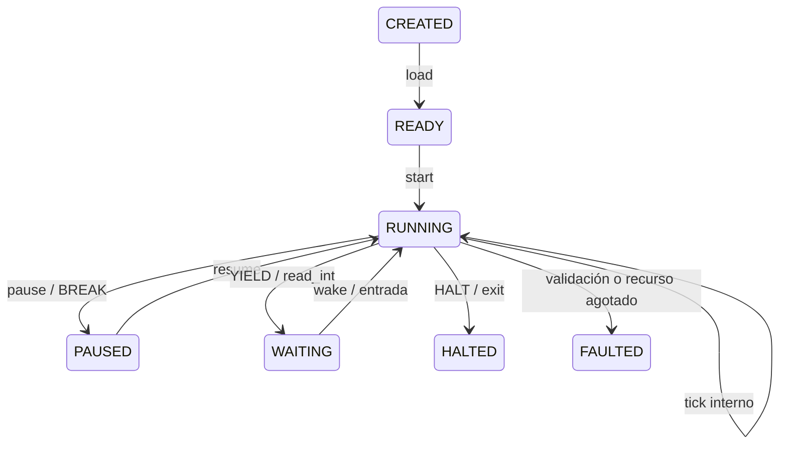

# Tramoya VM32

Tramoya VM32 es una máquina virtual RISC de 32 bits, determinista y embebible.
Está pensada para ejecutar lógica no confiable o extensible con límites claros,
no para emular eléctricamente una CPU física.

## Aplicaciones reales

- Lenguaje de scripting para videojuegos y simuladores.
- Reglas de negocio versionadas que no deben ejecutar Python arbitrario.
- Automatización determinista y reproducible.
- Plugins limitados por capacidades.
- Evaluación de código en ejercicios o retos.
- Contratos, flujos y agentes con presupuesto de ejecución.
- Lógica portable guardada como bytecode `.tvm`.
- Máquinas de control que deben pausar, esperar eventos y reanudarse.

No incorpora filesystem, red ni procesos como servicios predeterminados. Esas
capacidades solo pueden añadirse mediante syscalls explícitas del host.

## Capacidades

| Área | Implementación |
|---|---|
| Palabra | Entero con signo de 32 bits |
| Registros | 16 (`R0` cero, `R1..R14` generales, `R15` profundidad de pila) |
| Memoria | 1 048 576 palabras por defecto; configurable hasta 16 777 216 |
| ISA | 44 instrucciones de ancho fijo (4 palabras) |
| Banderas | Zero, Negative, Carry y Overflow |
| Control | Saltos, llamadas, retorno, breakpoints y ejecución paso a paso |
| Pila | Protegida por límite configurable |
| Interrupciones | 256 vectores, `INT`, `IRET`, `EI`, `DI` y cola externa |
| Host | Syscalls extensibles con políticas de capacidades |
| Recursos | Gas global, límite de pila, memoria y buffer de traza |
| Seguridad | Código de solo lectura, validación de PC/registros/memoria y rollback por instrucción |
| Persistencia | Snapshots paginados v2, compatibilidad v1 y bytecode con versión/CRC |
| Espera | Estado `WAITING`, entrada tardía y `YIELD` cooperativo |

## Uso

```powershell
# Programas incluidos
.\.venv\Scripts\python.exe tramoya_vm.py --demo hola
.\.venv\Scripts\python.exe tramoya_vm.py --demo factorial
.\.venv\Scripts\python.exe tramoya_vm.py --demo fibonacci
.\.venv\Scripts\python.exe tramoya_vm.py --demo array
.\.venv\Scripts\python.exe tramoya_vm.py --demo entrada --input 7 8

# Ensamblar a bytecode portable
.\.venv\Scripts\python.exe tramoya_vm.py programa.tasm --compile programa.tvm --no-run

# Ejecutar bytecode
.\.venv\Scripts\python.exe tramoya_vm.py programa.tvm

# Inspección
.\.venv\Scripts\python.exe tramoya_vm.py --demo factorial --listing --disassemble --trace

# Quitar permiso de salida
.\.venv\Scripts\python.exe tramoya_vm.py --demo hola --deny-capability io
```

Después de instalar el proyecto con `pip install -e .`, el mismo comando queda
disponible como `tramoya-vm`.

## Ensamblador

Cada instrucción ocupa cuatro palabras: opcode y tres campos. Esto simplifica la
validación, el salto aleatorio y la interpretación segura.

```asm
.code
.entry _start

_start:
        LEA R4, NUMEROS
        MOVI R2, 0
        MOVI R3, 4

BUCLE:
        LOAD R5, [R4]
        ADD R2, R2, R5
        ADDI R4, R4, 1
        SUBI R3, R3, 1
        CMPI R3, 0
        JPOS BUCLE

        MOV R1, R2
        SYSCALL 1
        HALT

.data
NUMEROS: .WORD 10, 20, 30, 40
```

Directivas disponibles:

- `.code` / `.data`: secciones ejecutable y de datos.
- `.entry ETIQUETA`: punto de entrada.
- `.equ NOMBRE VALOR`: constante.
- `.word`: datos de 32 bits.
- `.string`: texto terminado en cero.
- `.space`: reserva palabras inicializadas en cero.
- `.align`: alinea la sección de datos a una potencia de dos.

Los operandos de memoria aceptan `[R4]`, `[R4+8]`, `[R4-2]` o `[ETIQUETA]`.

## ISA

| Grupo | Instrucciones |
|---|---|
| Datos | `MOV`, `MOVI`, `LEA`, `LOAD`, `STORE` |
| Aritmética | `ADD`, `ADDI`, `SUB`, `SUBI`, `MUL`, `MULI`, `DIV`, `MOD` |
| Comparación | `CMP`, `CMPI`, `TEST` |
| Bits | `AND`, `OR`, `XOR`, `NOT`, `SHL`, `SHR` |
| Saltos | `JMP`, `JZ`, `JNZ`, `JNEG`, `JPOS`, `JC`, `JNC` |
| Pila y llamadas | `PUSH`, `POP`, `CALL`, `CALLR`, `RET` |
| Sistema | `SYSCALL`, `INT`, `IRET`, `EI`, `DI`, `SETIV` |
| Cooperación | `YIELD`, `BREAK`, `HALT`, `NOP` |

`HALT` termina correctamente con código 0. La syscall 0 termina con el código
explícito guardado en `R1`.

## Syscalls incluidas

| Número | Nombre | Convención | Capacidad |
|---:|---|---|---|
| 0 | `exit` | código en `R1` | ninguna |
| 1 | `print_int` | valor en `R1` | `io` |
| 2 | `print_char` | byte bajo de `R1` | `io` |
| 3 | `read_int` | resultado en `R1`; espera si no hay entrada | `io` |
| 4 | `memory_size` | resultado en `R1` | `introspection` |
| 5 | `cycles` | resultado en `R1` | `introspection` |
| 6 | `random` | PRNG determinista en `R1` | `random` |
| 7 | `print_string` | dirección `R1`, máximo `R2` | `io` |
| 8 | `alloc` | cantidad/resultado en `R1` | `memory` |

## Integración en Python

```python
from cpu_digital import TramoyaVM32, VM32Assembler

source = """
.code
    MOVI R1, 21
    SYSCALL 100
    SYSCALL 1
    HALT
"""

program = VM32Assembler().assemble(source).program
vm = TramoyaVM32()

def duplicar(machine: TramoyaVM32) -> None:
    machine.set_register(1, machine.get_register(1) * 2)

vm.register_syscall(100, duplicar, name="duplicar")
vm.load_program(program)
result = vm.run()
assert result.output == (42,)
```

Una syscall personalizada puede:

- Leer/escribir registros mediante `get_register()` y `set_register()`.
- Acceder a memoria validada con `read_memory()` y `write_memory()`.
- Emitir datos con `emit()`.
- Suspender con `wait_for_host()`.
- Finalizar mediante `terminate()`.

Si la syscall lanza una excepción, la VM pasa a `FAULTED` y revierte los cambios
de la instrucción, incluidas escrituras de memoria realizadas por la API.

## Interrupciones

Desde el host:

```python
vm.set_interrupt_vector(1, program.symbols["ISR_1"])
vm.request_interrupt(1)
vm.run()
```

Desde la CLI:

```powershell
.\.venv\Scripts\python.exe tramoya_vm.py --demo interrupcion --vector 1=ISR_1 --interrupt 1
```

El contexto interrumpido conserva PC, banderas y estado de habilitación. `IRET`
lo restaura; la profundidad está limitada para impedir desbordamientos.

## Memoria paginada y rendimiento

La RAM es lógica y dispersa: se divide en páginas de 4 096 palabras (16 KiB) y
solo materializa las páginas que reciben datos. La configuración predeterminada
expone 1 048 576 palabras (4 MiB lógicos), mientras que el máximo es 16 777 216
palabras (64 MiB lógicos). Un programa pequeño normalmente reserva una sola página.

La ejecución continua usa una ruta por lotes que conserva las transiciones finales
de Tramoya y la traza por instrucción, pero evita un `self-loop` de la máquina de
estados por cada opcode. `step()` conserva el camino totalmente instrumentado.

El código protegido se decodifica una vez al cargar. Si `protect_code=False` y una
escritura modifica una instrucción, la entrada afectada de la caché se invalida.
Los snapshots v2 guardan únicamente páginas no vacías y pueden restaurar snapshots
densos v1.

## Ciclo de vida Tramoya



Tramoya controla transiciones, hooks, historial de ciclo de vida, observabilidad,
rollback de callbacks, serialización del estado de control y exportación Mermaid.
`step()` usa la transición interna; `run()` ejecuta el bloque dentro de `RUNNING` y
solo dispara transiciones cuando cambia el ciclo de vida. La memoria y los registros
mantienen rollback por instrucción sin copiar toda la RAM.

## Modelo de seguridad

- El programa solo puede ejecutar direcciones alineadas dentro de `.code`.
- `STORE` no puede modificar código cuando `protect_code=True`.
- Registros, memoria, pila, destinos y vectores se validan en runtime, incluso
  cuando el bytecode no procede del ensamblador.
- Cada instrucción tiene coste de gas antes de ejecutarse.
- Una instrucción fallida revierte registros, flags, pila, E/S y escrituras RAM.
- Las syscalls están sujetas a capacidades del host.
- No hay acceso implícito a Python, disco, red, variables de entorno o procesos.
- El CRC detecta corrupción accidental; no sustituye una firma criptográfica.

Una syscall personalizada es código Python confiable del host. Si expone disco o
red, esa autoridad pertenece al host y debe diseñarse de forma explícita.

## Límites honestos

VM32 ya es utilizable como runtime embebido, pero no es una CPU física, un sistema
operativo ni una sandbox aislada a nivel de proceso. Es síncrona, de un solo hilo,
no tiene JIT ni recolector de basura. Para ejecutar código adversarial de alto
riesgo conviene además colocar el proceso Python dentro de un contenedor o sandbox
del sistema operativo.
